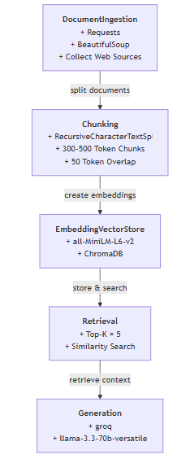

# Project 1 Planning: The Unofficial Guide

> Write this document before you write any pipeline code.
> Your spec and architecture diagram are what you'll use to direct AI tools (Claude, Copilot, etc.) to generate your implementation — the more specific they are, the more useful the generated code will be.
> Update the Retrieval Approach and Chunking Strategy sections if you change your approach during implementation.
> Update this file before starting any stretch features.

---

## Domain

<!-- What domain did you choose? Why is this knowledge valuable and hard to find through official channels? -->

This domain collects information about class-specific student communities, study groups, and course-related discussion spaces at universities across the United States. Students often struggle to find peers enrolled in the same courses because information about Discord servers, GroupMe chats, study groups, and academic communities is spread across multiple platforms and hidden within university-specific forums. An unofficial guide for this domain would help students locate relevant communities by university, course, subject, and professor.

---

## Documents

<!-- List your specific sources: URLs, subreddit names, forum threads, or file descriptions.
     Aim for at least 10 sources that together cover different subtopics or perspectives within your domain. -->

| # | Source | Description | URL or location |
|---|--------|-------------|-----------------|
| 1 | TopUniversities| 7 Types of US College Student Organization| https://www.topuniversities.com/blog/7-types-us-college-student-organization|
| 2 | Reddit | How to find study groups | https://www.reddit.com/r/college/comments/r53cbz/how_to_find_study_group/|
| 3 | UCLA |Student Organization |https://sa.ucla.edu/RCO/public/search?q=club |
| 4 | University of St. Thomas| Organization | https://tommielink.stthomas.edu/organizations|
| 5 | Centre Multi| Chemical Engineering at UST | https://www.centremulti.qc.ca/qc-news/chemical-engineering-at-ust-reddit-insights-and-discussions-1767647678 |
| 6 | University of Rochester| Collaborative Learning|https://www.rochester.edu/college/learningcenter/collaborative/study-groups.html |
| 7 | GitHub| Computer Science Crew | https://github.com/uvmcscrew |
| 8 | UVM Academic success centers | Student groups UVM| https://success.umn.edu/studygroups |
| 9 | University of Michigan-Dearborn | Professional student organizations | https://umdearborn.edu/cob/life-cob/professional-student-organizations|
| 10 | Texas A&M University | Course Descriptions | https://catalog.tamu.edu/undergraduate/course-descriptions/|

---

## Chunking Strategy

<!-- How will you split documents into chunks?
     State your chunk size (in tokens or characters), overlap size, and explain why those
     numbers fit the structure of your documents.
     A review-heavy corpus warrants different chunking than a long FAQ. -->

**Chunk size:**
300–500 tokens (about 1,200–2,000 characters) per chunk.

**Overlap:**
50 tokens (about 200 characters)

**Reasoning:**
Most of my sources are student organization directories, Reddit discussions, study-group pages, and course descriptions. A 300–500 token chunk is large enough to keep related information together while remaining specific for search. A small overlap helps preserve context between chunks without creating too much duplication.

---

## Retrieval Approach

<!-- Which embedding model are you using (e.g., all-MiniLM-L6-v2 via sentence-transformers)?
     How many chunks will you retrieve per query (top-k)?
     If you were deploying this for real users and cost wasn't a constraint, what tradeoffs
     would you weigh in choosing a different embedding model — context length, multilingual
     support, accuracy on domain-specific text, latency? -->

**Embedding model:**
all-MiniLM-L6-v2 via sentence-transformers

**Top-k:**
Retrieve the top 5 most relevant chunks for each query.

**Production tradeoff reflection:**
If cost were not a constraint, I would consider larger embedding models with higher accuracy and better understanding of academic and community-related text. I would also evaluate context length, multilingual support for international students, and retrieval quality versus response latency.

---

## Evaluation Plan

<!-- List your 5 test questions with their expected correct answers.
     Questions should be specific enough that you can judge whether the system's response
     is right or wrong. "What are good dining halls?" is too vague.
     "What do students say about wait times at [dining hall name] during lunch?" is testable. -->

| # | Question | Expected answer |
|---|----------|-----------------|
| 1 | What are the best study groups for Computer Science students at UVM? | The Computer Science Crew and other student organizations |
| 2 | Which clubs at University of St. Thomas supports Computer Science students? | The Computer Science Club, colorStack |
| 3 | What resources are available for Computer Science students at Texas A&M University? | Course descriptions, study groups, and academic support centers |
| 4 | Does the University of St. Thomas provide ways for students to connect through academic organizations? | Yes. Students can use TommieLink to find registered student organizations, including academic and professional groups related to their fields of study.|
| 5 | Are there class specific study groups for Computer Science at UVM? | Yes, there are several class-specific study groups available through the Computer Science Crew and other student organizations |

---

## Anticipated Challenges

<!-- What could go wrong? Name at least two specific risks with reasoning.
     Consider: noisy or inconsistent documents, missing source attribution, off-topic
     retrieval, chunks that split key information across boundaries. -->

1. Limited or incomplete information. Some universities or courses may not have active study-group pages or public communities, resulting in gaps in the knowledge base and making it difficult to answer certain user queries.

2.Off-topic or inconsistent information. Sources such as Reddit discussions may contain outdated, inaccurate, or unrelated comments, which could lead to retrieving information that is not useful for finding class-specific communities.

---

## Architecture

<!-- Draw a diagram of your pipeline showing the five stages:
     Document Ingestion → Chunking → Embedding + Vector Store → Retrieval → Generation
     Label each stage with the tool or library you're using.
     You can use ASCII art, a Mermaid diagram, or embed a sketch as an image.
     You'll use this diagram as context when prompting AI tools to implement each stage. -->

---

## AI Tool Plan

<!-- For each part of the pipeline below, describe:
     - Which AI tool you plan to use (Claude, Copilot, ChatGPT, etc.)
     - What you'll give it as input (which sections of this planning.md, which requirements)
     - What you expect it to produce
     - How you'll verify the output matches your spec

     "I'll use AI to help me code" is not a plan.
     "I'll give Claude my Chunking Strategy section and ask it to implement chunk_text()
     with my specified chunk size and overlap" is a plan. -->

     1. Document Ingestion: I will use Copilot to create a Python script that downloads and extracts text from the URLs listed in my Documents section.

     Expected Output:
     Python functions to load web pages
     Text extraction and cleaning logic
     
     Verification:
     Confirm all listed sources are processed successfully.
     Check that extracted text is readable and not empty.

     2. Chunking: I will use copilot to implement a chunk_text() function that splits documents into chunks of 300–500 tokens with a 50-token overlap.

     Expected Output:
     Python chunking function
     Support for overlap between chunks

     Verification:
     Inspect sample chunks manually.
     Confirm chunk sizes stay within the target range.
     Confirm overlapping text appears between adjacent chunks.

     3. Embedding and Vecto Store: I will use Claude to generate code that creates embeddings using sentence-transformers all-MiniLM-L6-v2 and stores them in a ChromaDB.

     Expected Output:
     Code to load the embedding model
     Embedding generation for all chunks
     ChromaDB collection creation
     Storage of chunk text, embeddings, and metadata

     Verification:
     Confirm an embedding is generated for every chunk.
     Verify chunks and metadata are successfully stored in ChromaDB.

     4. Retrieval: I will use Claude to Implement a retrieve() function that embeds a query and returns the top 5 most relevant chunks from a ChromaDB index.

     Expected Output:
     Query embedding code
     Similarity search function
     Ranked retrieval results

     Verification:
     Run the evaluation questions.
     Check whether retrieved chunks contain relevant information.
     Confirm exactly five chunks are returned.

     5. Generation: I will use claude to create a response generation function that uses retrieved chunks as context and answers student questions while citing sources.

     Expected Output:
     Prompt template
     Response generation logic
     Source attribution

     Verification:
     Test all five evaluation questions.
     Compare responses against expected answers.
     Verify answers use retrieved information and include source references.
     

**Milestone 3 — Ingestion and chunking:**

**Milestone 4 — Embedding and retrieval:**

**Milestone 5 — Generation and interface:**
